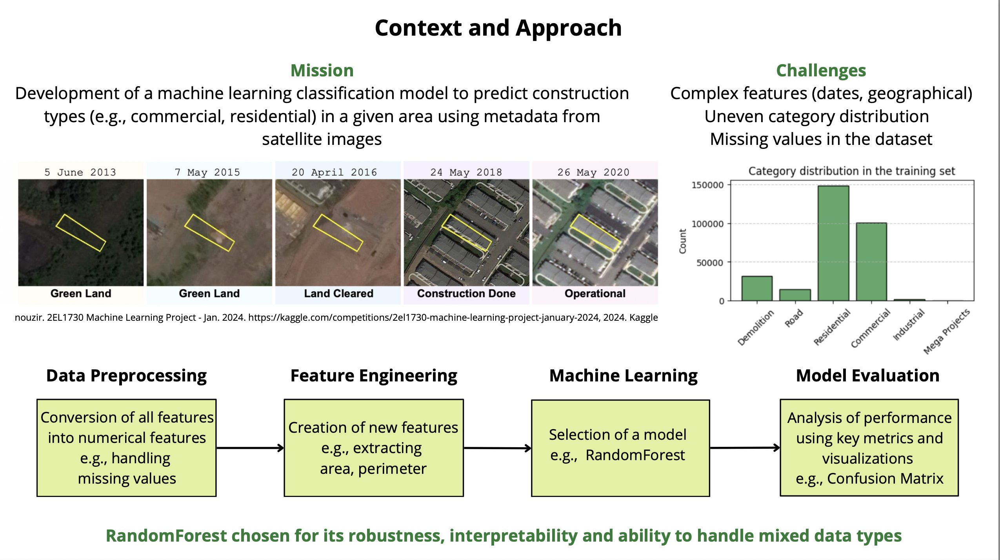
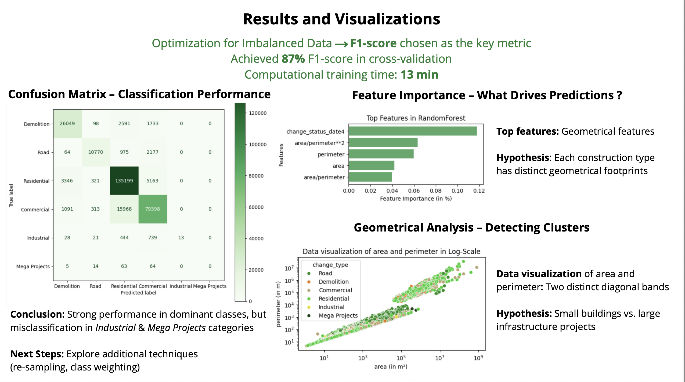

# Construction_area_detection

# 🛰️ Construction Area Detection

Classify satellite imagery into **six types of construction sites** using feature engineering and traditional ML models.  
This project demonstrates a full data science workflow — from preprocessing and feature creation to model tuning and performance evaluation.

---

## 🚀 Overview

Urban growth and construction monitoring generate huge amounts of satellite data.  
This project aims to **automatically classify construction zones** into the following categories:

- 🏗️ Demolition  
- 🛣️ Road  
- 🏘️ Residential  
- 🏢 Commercial  
- 🏭 Industrial  
- 🏙️ Mega Projects  

The dataset combines polygon-based area descriptions, color intensity features, timestamps of construction stages, and environmental metadata.  
We engineered features, reduced dimensionality, and compared multiple algorithms to identify the best performing approach.

---

## ⚙️ Pipeline Summary

| Step | Description |
|------|--------------|
| **Data preprocessing** | Encoded categorical data (Label, One-Hot), normalized dates into relative time deltas |
| **Feature engineering** | Created features for color variance, gray intensity, area/perimeter ratios, and construction deltas |
| **Missing data handling** | Replaced unassigned values with column means |
| **Dimensionality reduction** | Applied PCA (95% variance) and LDA (5D output) |
| **Modeling** | Compared KNN, SVM (RBF), and Random Forest (n=200) using cross-validation |
| **Evaluation** | Selected Random Forest as best model — 0.82 accuracy on test data |

---

## 🧠 Results

| Model | Preprocessing | Accuracy |
|--------|----------------|-----------|
| KNN | LDA | 0.60 |
| SVM (RBF) | LDA | 0.62 |
| Random Forest | None | **0.82** |

- **Random Forest** outperformed others without dimensionality reduction, confirming its robustness to high-dimensional features.  
- PCA and LDA slightly degraded performance but improved interpretability.

---

## 🛠️ Tech Stack

- **Languages:** Python  
- **Libraries:** NumPy, Pandas, Scikit-learn, Matplotlib  
- **Methods:** Feature Engineering, PCA, LDA, Cross-Validation  
- **Environment:** Jupyter Notebook  

---

## 📈 Key Learnings

- Feature engineering had a stronger impact on accuracy than model selection.  
- Proper handling of temporal and spatial metadata is critical in satellite analysis.  
- Traditional ML (Random Forest) can outperform deep models with well-crafted features.  

---

## 📚 Future Work

- Tune model hyperparameters via **grid search or gradient-based optimization**.  
- Integrate CNN-based visual features for hybrid (image + metadata) learning.  

## ✅ Summary

**Goal:** Detect and classify construction types in satellite imagery.  
**Result:** 0.82 accuracy using Random Forest (n=200).  
**Impact:** Demonstrates the full ML lifecycle — preprocessing, feature engineering, modeling, and evaluation — on real-world geospatial data.

---

